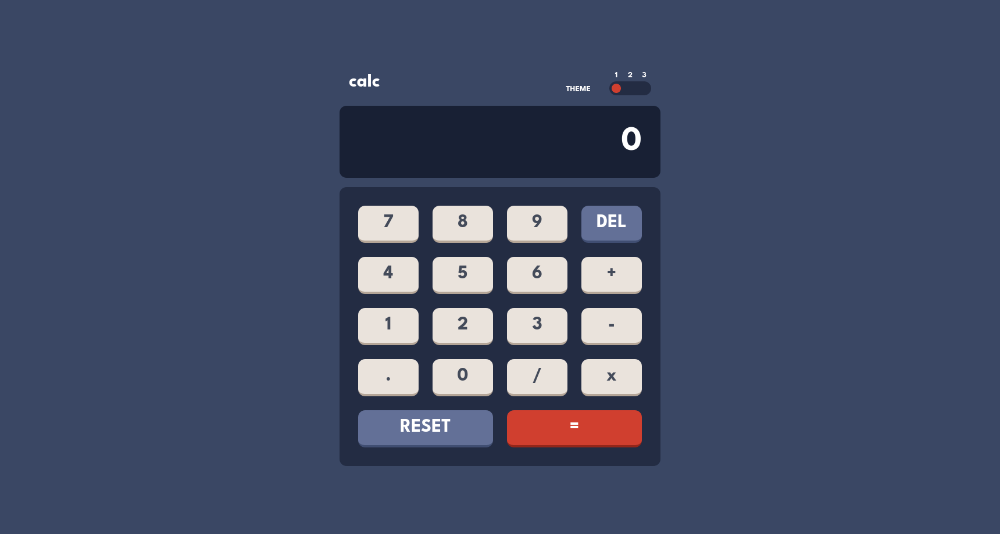

# Frontend Mentor - Calculator app solution

This is a solution to the [Calculator app challenge on Frontend Mentor](https://www.frontendmentor.io/challenges/calculator-app-9lteq5N29).

## Live Demo

https://giorgi-kiknavelidze.github.io/Calculator/

## Built With

- React
- Typescript
- Tailwindcss
- Decimal.js
- Vite

## Screenshot



## Run The Project

```sh
npm install
# Run in development mode:
npm run dev
# Build and preview in production mode:
npm run build && npm run preview
```
